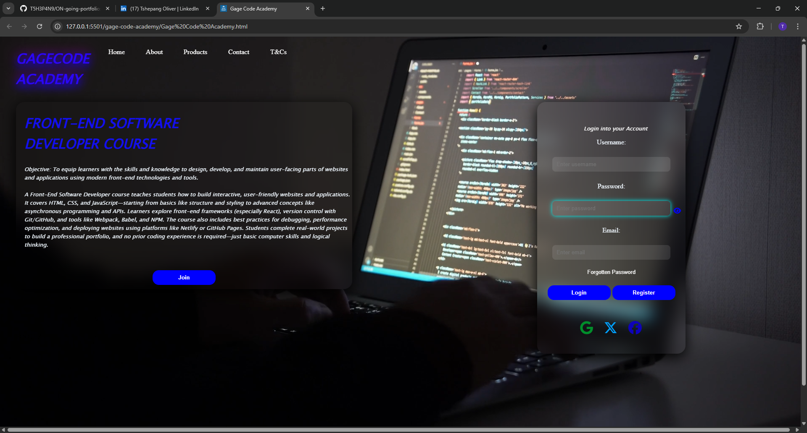

# Gage Code Academy – Front-End Web Project (Improved Version)

A responsive, animated front-end landing page for a fictional coding academy – built to showcase modern HTML and CSS techniques.

## 🌐 Project Overview

This upgraded version of the Gage Code Academy landing page enhances the original design with:

- 🔷 A full-screen background video
- 🔷 Responsive and mobile-friendly layout
- 🔷 Animated navigation bar and smooth hover effects
- 🔷 HTML/CSS course sections with visual hierarchy
- 🔷 Styled login and registration forms with Font Awesome icons
- 🔷 Optimized layout using CSS Flexbox and media queries

## 🛠️ Technologies Used

- HTML5
- CSS3
- Font Awesome
- Basic JavaScript (for interactivity)

## 🚀 Improvements Made

- Rewritten CSS for maintainability and responsiveness
- Cleaned up HTML structure and semantics
- Improved visual design (typography, spacing, button styles)
- Introduced one-time animation effects (no loop on hover)
- Fixed layout for mobile, tablet, and desktop screens

## 📸 Project Preview

## 👤 Developer

**Tshepang Oliver**  
Front-End Developer | HTML, CSS & JavaScript  
[GitHub Profile] | [LinkedIn Profile]
