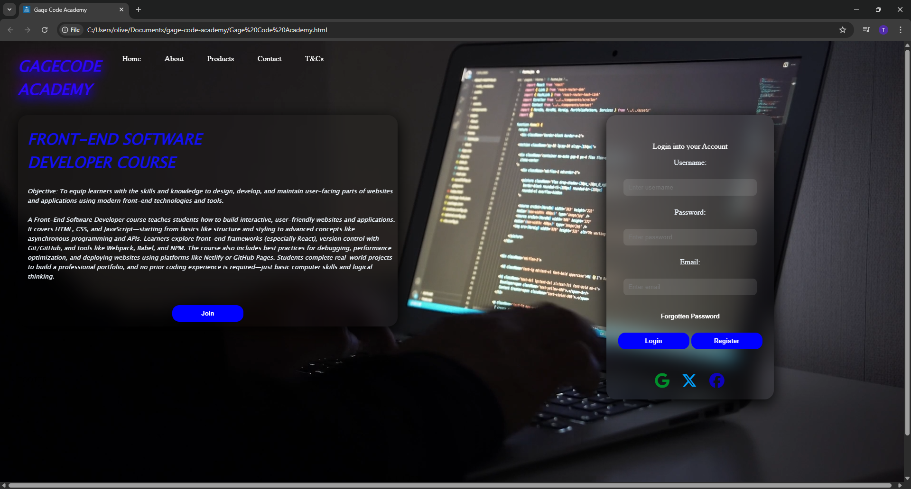

# Gage Code Academy – Front-End Web Project

A responsive front-end landing page for a fictional coding academy.

## 🌐 Project Overview

This project simulates a marketing page for a beginner-friendly coding course. It features:

- 🔷 Full-screen background video
- 🔷 Responsive navigation bar
- 🔷 HTML/CSS course description
- 🔷 Login and registration form
- 🔷 Social login buttons using Font Awesome
- 🔷 Animations and hover effects

## 🛠️ Built With

- HTML5
- CSS3
- Font Awesome

## 🚀 Features to Add Later (Ideas)

- Backend login validation
- Course enrollment system
- Mobile-first UI redesign

## 📸 Preview

*

## 👤 Author

**[ Full Name]**  
[T5H3P4N9(Tshepang Oliver)]
 
